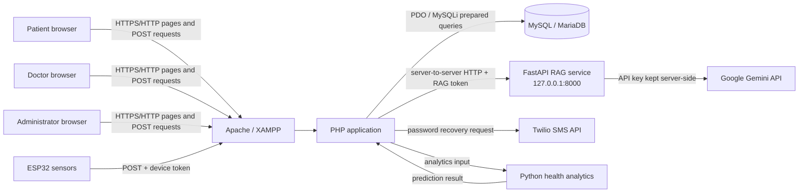
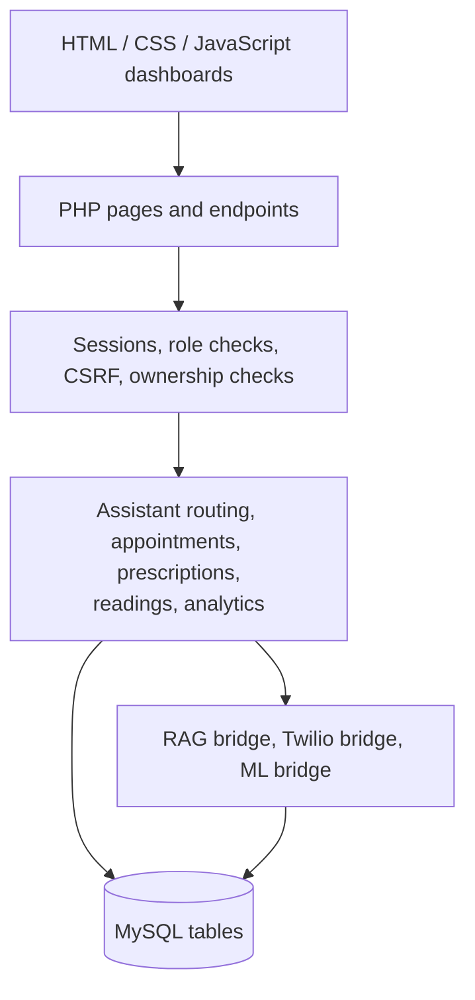
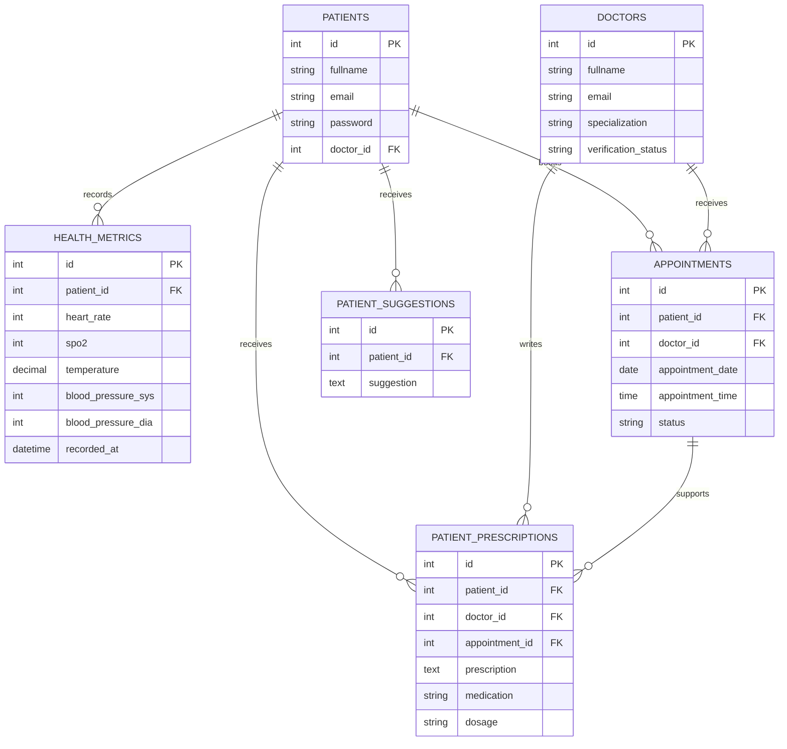
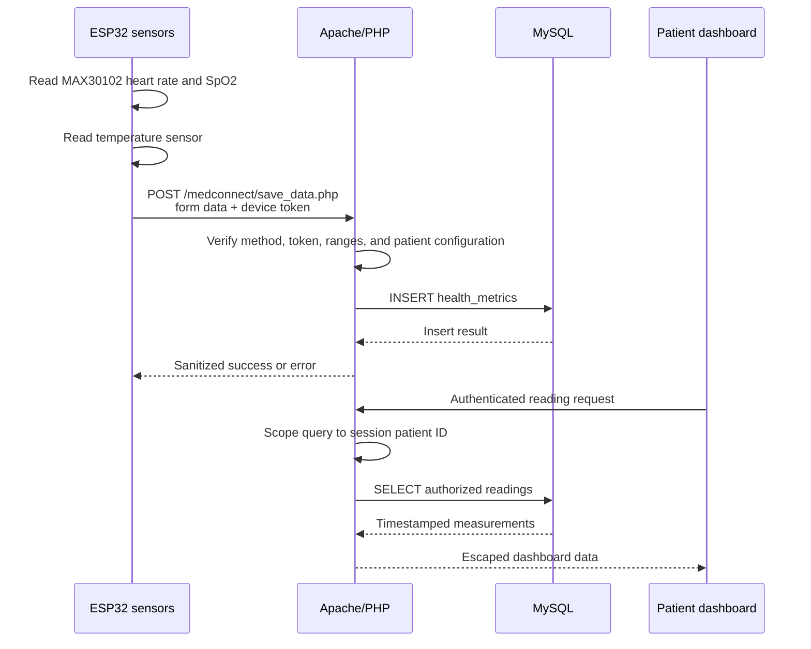
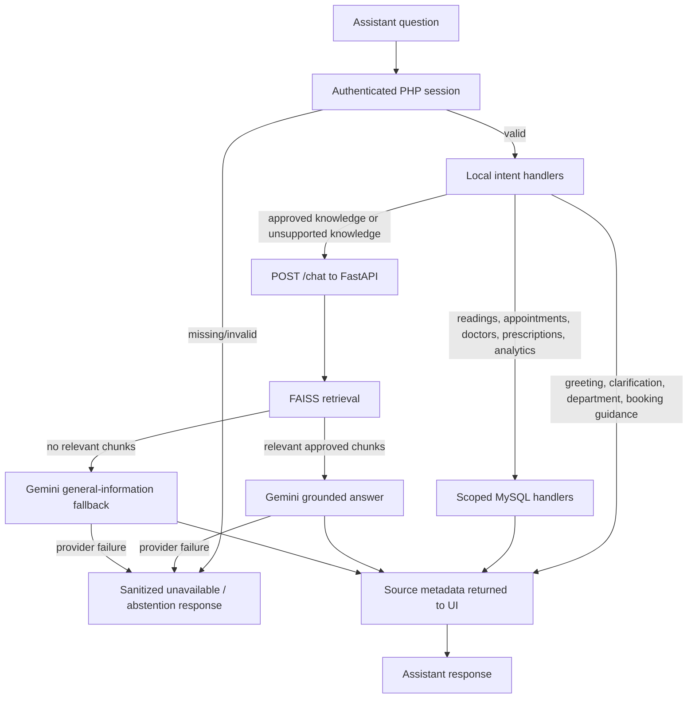
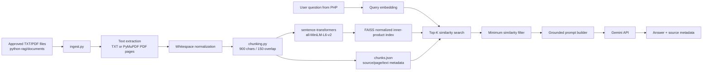

# MedConnect Architecture

This document describes the current MedConnect application, its connections, the
RAG pipeline, and the path from an ESP32 measurement to a user-visible answer.

> MedConnect is an educational health-monitoring project. It is not a clinical
> decision system and must not be used as a substitute for a qualified clinician.

## 1. System context



### Trust boundaries

1. **Browser boundary**: browsers may submit user-controlled form and assistant
   input. Authentication, authorization, CSRF checks, and output escaping happen
   in PHP.
2. **Device boundary**: the ESP32 is not trusted by URL parameters alone.
   `save_data.php` accepts POST data only when the configured
   `X-MedConnect-Device-Token` matches.
3. **Database boundary**: MySQL contains private patient data. Queries must use
   the authenticated patient ID or an authorized doctor-patient appointment.
4. **RAG boundary**: the browser never calls FastAPI or Gemini directly. PHP
   calls the loopback RAG service with `X-MedConnect-Token`.
5. **External-service boundary**: only the RAG service sends approved excerpts
   and general-information prompts to Gemini. Patient readings and identifiers
   are handled by PHP/MySQL and are not included in Gemini prompts.

## 2. Application layers



### Main web surfaces

| Surface | Responsibility |
| --- | --- |
| `index.html`, role and login pages | Public entry and authentication UI |
| `patient-dashboard.php` | Patient readings, appointments, prescriptions, analytics, and assistant |
| `doctor-dashboard.php` | Authorized patient views, appointments, and prescriptions |
| `admin-dashboard.php` | Doctor verification, patient administration, appointments, and exports |
| `gemini-chat.php` | Authenticated assistant router and RAG gateway |
| `save_data.php` | Device measurement ingestion |
| `add-health.php` | Authenticated/manual health-record insertion |
| `book_appointment.php` | Patient appointment creation |
| `get_patient_metrics.php` | Authorized metrics retrieval |
| `patient-prediction.php`, `predict_health.php` | Health analytics UI and prediction bridge |

## 3. Database relationships



The schema source is [`read me .txt/sql.txt`](<read me .txt/sql.txt>). The
database is the source of truth for private records; generated CSV exports are
operational artifacts and must not be used as the RAG corpus.

## 4. Health-reading connection flow



The device endpoint must receive `DEVICE_INGEST_TOKEN` from server environment
configuration. The device example is in
[`read me .txt/iot_esp32_MAX30102_K12/iot_esp32_MAX30102_K12.txt`](<read me .txt/iot_esp32_MAX30102_K12/iot_esp32_MAX30102_K12.txt>).

## 5. Assistant routing and connections



### Request sequence

```mermaid
sequenceDiagram
    participant B as Browser
    participant PHP as gemini-chat.php
    participant DB as MySQL
    participant R as FastAPI RAG
    participant G as Gemini

    B->>PHP: POST question + assistant CSRF token
    PHP->>PHP: Verify session, role, CSRF, and input
    alt Private record intent
        PHP->>DB: Query using patient/doctor authorization
        DB-->>PHP: Private record rows
        PHP-->>B: Record answer; no Gemini request
    else Knowledge intent
        PHP->>R: POST question + X-MedConnect-Token
        R->>R: Embed query and search approved FAISS index
        alt Relevant chunks found
            R->>G: Grounded prompt with excerpts only
            G-->>R: Answer
        else No relevant chunks
            R->>G: General-information prompt without private data
            G-->>R: Labelled general answer
        end
        R-->>PHP: Answer, sources, or sanitized error
        PHP-->>B: Escaped answer and source list
    end
```

## 6. RAG architecture



### RAG files and responsibilities

| File | Responsibility |
| --- | --- |
| `python-rag/config.py` | Environment variables, paths, model, top-K, and similarity settings |
| `python-rag/ingest.py` | Read approved files, extract text, chunk, embed, and write local index files |
| `python-rag/chunking.py` | Deterministic overlapping character chunking |
| `python-rag/retrieval.py` | Load FAISS and metadata, embed questions, and rank chunks |
| `python-rag/gemini_service.py` | Build grounded/general prompts and call Gemini |
| `python-rag/app.py` | FastAPI `/health` and authenticated `/chat` routes |
| `python-rag/schemas.py` | Request and response models |
| `python-rag/data/knowledge.faiss` | Generated vector index; never hand-edit or commit |
| `python-rag/data/chunks.json` | Generated chunk/source metadata; never hand-edit or commit |

## 7. Chunking in detail

Chunking converts an approved document into retrieval-sized passages. The
following strategies are relevant to the MedConnect RAG design:

### 7.1 Fixed-size chunking

Splits text into uniform sizes based on character or token counts, often using
an overlap to keep neighboring context intact. This is the strategy currently
implemented by [`python-rag/chunking.py`](./python-rag/chunking.py). It is
deterministic, fast, easy to test, and works consistently for TXT files and
PDF-extracted text.

The current configuration uses 900-character chunks and a 150-character
overlap:

```text
normalized document text
        |
        v
start = 0
while start < text length:
    end = min(start + 900, text length)
    emit text[start:end]
    start = end - 150
```

For a 2,400-character document, the approximate windows are:

```text
chunk 1: characters   0 - 899
chunk 2: characters 750 - 1649
chunk 3: characters 1500 - 2399
```

The 150-character overlap preserves context when a definition or procedure
crosses a boundary. Each emitted chunk retains:

- source filename;
- page number for PDF content, when available;
- chunk index;
- chunk text;
- document metadata used to display citations.

### 7.2 Recursive chunking

Breaks text down hierarchically using a list of separators, such as headings,
paragraphs, sentences, and finally words or characters, until the target size
is reached. This is useful when a document has readable paragraph boundaries
and fixed offsets would split a sentence or list item. A future implementation
could use recursive chunking for longer technical guides while preserving
page-level metadata.

### 7.3 Structure-based chunking

Divides documents using natural file markers such as Markdown headers, HTML
tags, tables, or code blocks. This is useful for keeping a complete section,
API example, schema definition, or procedure together. For MedConnect, the
source document title, section heading, table, and page should be retained as
metadata when this strategy is enabled.

### 7.4 Semantic chunking

Measures the meaning and similarity between neighboring sentences and splits
when there is a major shift in topic. This can improve retrieval for documents
that move between unrelated subjects without clear headings, but it requires
additional sentence embedding work during ingestion and makes chunk boundaries
less predictable.

### 7.5 LLM-based or agentic chunking

Uses an LLM or an agent to identify meaningful topic boundaries, summarize
sections, or create task-oriented passages. This can be useful for complex
clinical or technical references, but it adds cost, latency, provider
dependency, and an additional data-processing trust boundary. It must never be
allowed to process patient exports, credentials, or unrestricted database
content.

### 7.6 Strategy selection for MedConnect

The production path currently uses **fixed-size overlapping chunking** because
the approved corpus is small, local, and technical. The strategies above are
design options, not claims that every strategy is active in the current code.
A safe evolution path is:

1. Start with fixed-size chunks as the deterministic baseline.
2. Add recursive or structure-based boundaries for headings and paragraphs.
3. Evaluate semantic chunking only if retrieval tests show topic-boundary
   failures.
4. Use LLM-based/agentic chunking only for reviewed public reference material,
   with versioned outputs and an explicit approval step.
5. Compare each change using the same question set, source hit rate, answer
   grounding, and abstention behavior before changing the default.

Chunking does not ingest MySQL rows, patient exports, `.env` files, or browser
conversation history. To rebuild after an approved document changes:

```powershell
py python-rag\ingest.py
```

The rebuild replaces the generated FAISS index and metadata, so removed source
documents are not retained in the next local index.

## 8. Retrieval and answer policy

1. PHP authenticates the user before forwarding a knowledge question.
2. FastAPI verifies `X-MedConnect-Token`.
3. The query is embedded with the same model used during ingestion.
4. FAISS returns the configured top-K candidates.
5. Candidates below `RAG_MIN_SIMILARITY` are removed.
6. Relevant excerpts are sent to Gemini with a source-grounding instruction.
7. The response includes source filename/page metadata.
8. If no approved excerpt is relevant, the service may use Gemini's explicitly
   labelled general-information fallback.
9. Gemini/provider failures become a sanitized temporary-unavailability response.

Private readings, appointments, prescriptions, patient names, session IDs, and
database exports stay in the PHP/MySQL path. They are not used to create the
embeddings or included in RAG prompts.

## 9. Runtime configuration and connection checklist

| Connection | Configuration | Expected direction |
| --- | --- | --- |
| Browser -> Apache | `http://localhost/medconnect/` | Browser to PHP |
| PHP -> MySQL | `DB_HOST`, `DB_PORT`, `DB_USER`, `DB_PASSWORD`, `DB_NAME` | Server only |
| PHP -> RAG | `RAG_URL`, `RAG_SERVICE_TOKEN` | Loopback server-to-server |
| RAG -> Gemini | `GEMINI_API_KEY`, `GEMINI_MODEL` | RAG server only |
| ESP32 -> PHP | `DEVICE_INGEST_TOKEN`, `save_data.php` | Device POST |
| PHP -> Twilio | `TWILIO_*` values | Server only |
| PHP -> analytics | Python executable and `ml/predict_health.py` | Server-side process |

Never put any token, API key, database password, or patient export into
`python-rag/documents/`, browser JavaScript, HTML, Git, Docker images, or chat
messages.

## 10. Operational startup order

1. Start MySQL and Apache in XAMPP.
2. Confirm the database schema is imported.
3. Configure the root `.env` without committing it.
4. Install Python dependencies.
5. Run `py python-rag\ingest.py` after approved documents change.
6. Start FastAPI with `run-rag.cmd` or Uvicorn on `127.0.0.1:8000`.
7. Confirm `GET http://127.0.0.1:8000/health`.
8. Open `http://localhost/medconnect/` and sign in.

The dashboards and database-backed features should remain available if the RAG
service or Gemini is temporarily unavailable; only knowledge-answer requests
should degrade to a sanitized error or fallback response.
